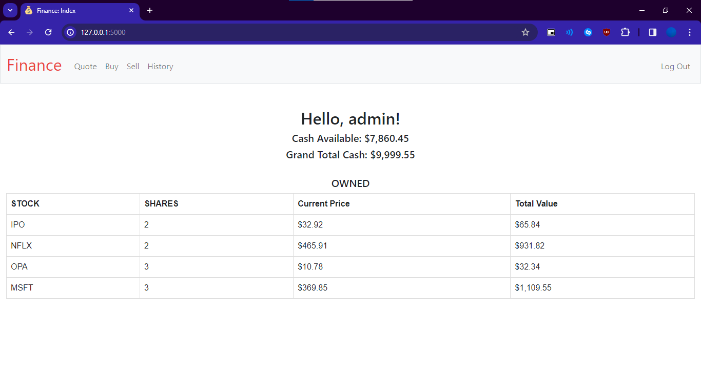
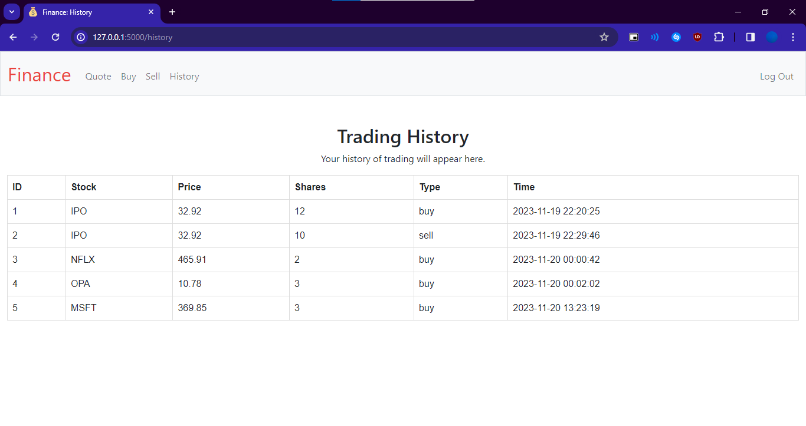

#  Finance 

A website template that allows you to interact with a simulated version of the stock market. Let's users quote, buy and sell stocks, as well as displaying full user history.

> Finance is a problem set by HarvardX's CS50 course.
What you see is my implementation of the problem.

## Screenshots



## How It Was Made
Finance was made using Python, HTML, and CSS.
With the following Modules:
- CS50: for the SQL library;
- Flask: to use Python for Web Applications;
- Flask_session: to add support for server-side sessions;
- Werkzeug: to encrypt passwords, create and check hashes.

Complimentary:
- Bootstrap CSS Library.
- Jinja2 Web Template;
- Yahoo Finance API.

## How It Works
Index Page: On first open checks if user is logged in, if not then displays the default message prompting the user to register/login.

Register Page: User is prompted for a unique username, password and confirmation of password. Checks in form of SQL queries are in place to verify user has unique username and password and confirmation match. If all checks are valid, a hash of the user's password is created and stored in the users table on finance.db.

Login Page: User is prompted for valid username and password, passwords attempts are compared as hashes with SQL queries with what's stored in finance.db. If username and password match, user is logged in, their session_id is saved, and user is redirected to index page.

Index Page (logged): If user is logged in SQL queries are in place to get user's general information (name, available cash, total cash, stocks and their data), then user is redirected again to the index page but this time the Jinja in index.html receives all required user information, so these info are displayed instead of the default message.

Quote Page: User has to write a valid stock symbol to search, then a request is made to the lookup function (from helpers.py), there a query is made to the Yahoo Finance API using the stock symbol and returns the real data of said stock at the time of the request.

Buy Page: User writes a valid stock symbol and amount of shares to buy, then checks are made to make sure the stock exists and user has enough cash to buy that amount of shares, if all tests pass, the transaction details are stored in the database, user's cash amount is deducted from the database, and the user's portfolio is updated to display new amount of owned stocks.

Sell Page: A dropdown menu displays all owned stocks by logged user, after choosing a valid option and typing amount of stocks, checks are in place to make sure user has said stock and the amount typed. If all checks pass, user's cash is updated on database, stock is removed from user's portfolio and transaction details are written on finance.db.

History Page: A query is made to the transaction details table on database to check all operations by the logged in user id, then user is redirected to the history page, but this time with all the information the Jinja template loads all transaction details available in the database. The history page is completely personal and users only see their own history.

Most pages require a session id to load, so the user has to be logged in to access, this is achieved with the login_required decorator from helpers.py.

## More Information
If you want to run this website locally, you'll need Python and all modules from requirements.txt, clone the repository and on the cloned app.py directory type the command ```flask run```

For anything else check the [official Flask deploying instructions](https://flask.palletsprojects.com/en/3.0.x/deploying/).

> This project was a suggested problem from HarvardX's CS50 course and was made by me to acquire experience with Flask, Jinja, creating and manipulating databases with SQL, login systems and password storage with hashes, using Bootstrap as CSS library, and querying to an API with the Yahoo Finance API.
